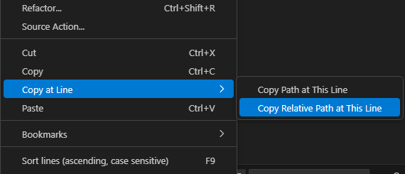

# Copy at Line

VS Code extension to quickly copy file path with current line number via right-click context menu.

## Features

- **Copy Path at This Line** – Full absolute file path with line number  
  (e.g., `/home/user/project/file.ts:42`)

- **Copy Relative Path at This Line** – Path relative to your workspace  
  (e.g., `src/file.ts:42`)

Both options are accessible via right-click context menu in the editor under the submenu **"Copy at Line"**.

## How to Use

1. Right-click on any line in the code editor
2. Select `Copy at Line > Copy Path at This Line` or `Copy Relative Path at This Line`
3. The value is copied to clipboard

## Example

🖱️ Right-click context menu:

## Requirements

None.

## Extension Settings

This extension has no settings.

## Release Notes

### 0.0.1

- Initial release with both copy path features

## Repository

[GitHub](https://github.com/nguyenduy4321/copy-at-line-vsce)
